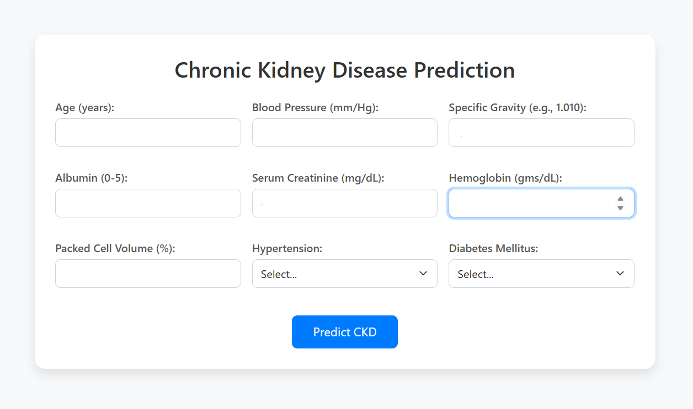

# Chronic Kidney Disease (CKD) Prediction System




## 1. Project Overview

This project is an intelligent web application designed to predict the likelihood of Chronic Kidney Disease (CKD) in patients based on key clinical indicators. It leverages a supervised machine learning model to provide fast, accessible, and data-driven insights, demonstrating a practical application of AI in healthcare. This was developed as my final project during my AI/ML internship.

## 2. Key Features

- **End-to-End ML Pipeline:** Covers the complete workflow from data cleaning and preprocessing to model training and deployment.
- **Accurate Predictive Model:** Utilizes a **Random Forest Classifier** from Scikit-learn, trained on a real-world medical dataset for robust performance.
- **Interactive Web Interface:** A user-friendly and responsive front-end built with **Flask** and **Bootstrap** allows for easy data input and provides instant, clear prediction results.

## 3. Technologies & Skills Demonstrated

*   **Programming:** Python
*   **Machine Learning:** Scikit-learn, Pandas, NumPy, Joblib
*   **Web Development:** Flask (for backend), HTML5, CSS3, Bootstrap (for frontend)
*   **Data Handling:** Data Cleaning, Preprocessing, Feature Selection
*   **Development Tools:** Git, VS Code, GitHub

## 4. System Architecture

The application follows a simple, modular architecture:

1.  **Frontend (index.html):** A user inputs 9 clinical features into a web form.
2.  **Backend (app.py - Flask):** The Flask server receives the data via a POST request.
3.  **Preprocessing:** The backend validates and converts the user input into a format suitable for the model.
4.  **Prediction:** The trained Random Forest model (`model.pkl`) is loaded using Joblib and makes a prediction (0 or 1).
5.  **Output:** The numerical prediction is interpreted and sent back to the frontend to be displayed as "CKD Detected" or "No CKD Detected."

## 5. How to Run This Project Locally

To get a local copy up and running, follow these simple steps.

### Prerequisites

- Python 3.8+ installed
- `pip` package manager

### Installation & Execution

1.  Clone the repository to your local machine:
    ```sh
    git clone https://github.com/your-username/Chronic-Kidney-Disease-Prediction-CKD.git
    ```
2.  Navigate into the project directory:
    ```sh
    cd Chronic-Kidney-Disease-Prediction-CKD
    ```
3.  Install the required Python packages:
    ```sh
    pip install -r requirements.txt
    ```
4.  Run the Flask application:
    ```sh
    python app.py
    ```
5.  Open your web browser and navigate to `http://127.0.0.1:5000` to see the application live.

## 6. Future Enhancements

- **Improve Model Accuracy:** Integrate more advanced models like XGBoost or a simple Neural Network and train on a larger, more diverse dataset.
- **Add Explainable AI (XAI):** Use libraries like SHAP or LIME to show *which features* most influenced a prediction, increasing trust and clinical utility.
- **Cloud Deployment:** Deploy the application to a cloud service like Render or AWS to make it publicly accessible.
